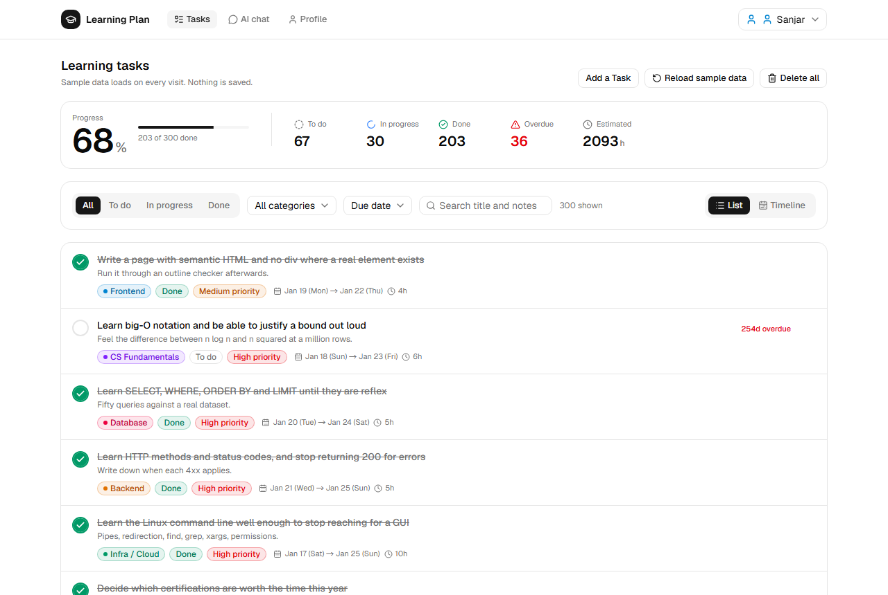
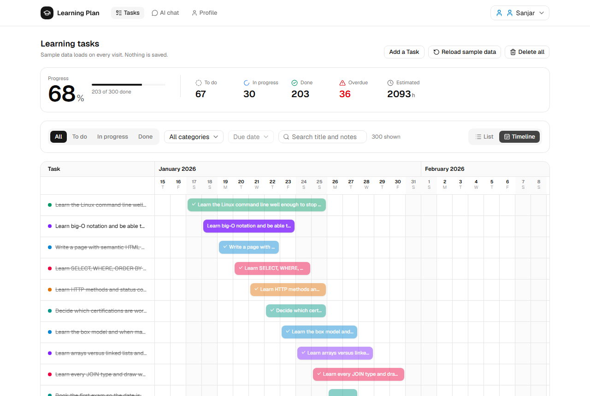
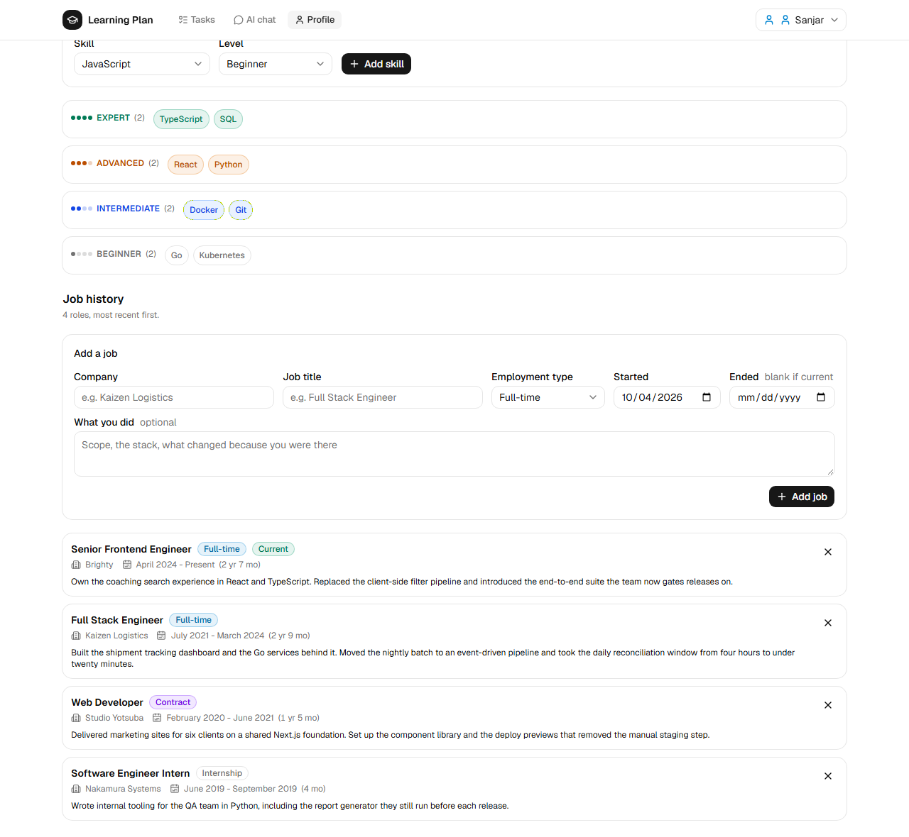
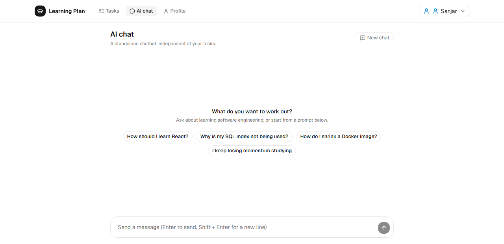

# Learning Plan

A study planner for someone teaching themselves software engineering.
**[`doc/product.md`](doc/product.md) explains what it is for** — read that first if
you want the why rather than the how.

- **Tasks** — add, delete and browse study tasks, with a switch between a list view
  and a Gantt-style timeline.
- **Profile** — technical skills for a resume.
- **AI chat** — a standalone chatbot, unrelated to the other pages.

## The app

**Tasks** — the plan as a list: progress, filters, search and a page of tasks at a
time.



The same tasks as a timeline, which is where overlapping work and a slipping due
date actually show up.



**Profile** — skills grouped by level.



**AI chat** — a chatbot that knows nothing about your tasks, on purpose.



## Layout

Two packages, each with its own `package.json` and its own dependencies.

```
frontend/   the app: React, Vite, Tailwind, shadcn/ui
backend/    Fastify. Serves sample task and profile data
doc/        documentation about the repo and the product, plus the README images
vercel.json routes the deployment to frontend/
```

Nothing is persisted. Tasks are seeded from the backend and live in memory for the
session; skills are seeded once from the backend and edited in memory
after that; the chat page calls a completions endpoint straight from the browser.

## Running it

Each package installs separately. Run both servers to load the sample tasks and
profile data. If loading fails, the forms still work with an empty list.

**Frontend**

```bash
cd frontend && npm install && npm run dev
```

Open http://localhost:5173.

**Backend**

```bash
cd backend && npm install && npm run dev
```

Serves `GET /api/tasks` and `GET /api/skills` on http://localhost:3001.

Node 20.19+, 22.13+ or 24+. The frontend's `engines` field declares the range, so
`npm install` warns if you are outside it.

## Documentation

| Where                                                                | What                                                                   |
| -------------------------------------------------------------------- | ---------------------------------------------------------------------- |
| [`doc/product.md`](doc/product.md)                                   | What the product is for and who for. No technology                     |
| [`doc/branch-naming.md`](doc/branch-naming.md)                       | Where branches start, what they are called, how work reaches `develop` |
| [`frontend/README.md`](frontend/README.md)                           | The frontend's stack, setup and scripts                                |
| [`frontend/doc/getting-started.md`](frontend/doc/getting-started.md) | A tour of the frontend codebase for a first read                       |
| [`frontend/doc/coding.md`](frontend/doc/coding.md)                   | Why the frontend code is arranged the way it is                        |
| [`frontend/AGENTS.md`](frontend/AGENTS.md)                           | The frontend's conventions, as a list of rules                         |

## Working on it

Branch from `develop`, never commit to `develop` or `main` directly, and merge
through a pull request — [`doc/branch-naming.md`](doc/branch-naming.md) has the rule
and the naming.

Before calling frontend work done, all five must pass from `frontend/`:

```bash
npm run format-check
npm run lint
npm run type-check
npm run test-unit
npm run test-e2e
```

The backend has `npm run type-check`.
